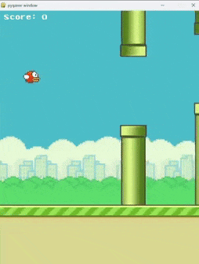

# Flappy Bird – Python (Pygame)

A Python-based recreation of the classic **Flappy Bird** game, built using the **Pygame** library.  
This project focuses on smooth gameplay mechanics, physics-based movement, collision detection, and clean modular code.

---

## 🎮 Demo

> 📌 **Gameplay Preview**



---

## 🎮 Features
- Smooth **jump physics** and gravity-based movement  
- Random **pipe generation** with increasing difficulty  
- Accurate **collision detection** (pipes and ground)  
- **Score tracking** with real-time updates  
- Start, play, and game-over screens  
- Organized assets for images and sounds  
- Clean, modular code structure  

---

## 🛠 Tech Stack
- **Python**
- **Pygame**

---

## 📚 What I Learned
- Game loop & event handling  
- Physics-based object movement  
- Sprite rendering & animation  
- Collision detection logic  
- Debugging and code structuring  

---

## ▶️ How to Run

```bash
pip install pygame
python flappy_bird.py

## 📂 Project Structure

Flappy-Bird/
│── assets/          # Game images and sounds
│── bird.py          # Bird movement and physics
│── flying.py        # Main game loop and logic
│── pipe.py          # Pipe generation and movement
│── README.md
│── demo.gif
>>>>>>> master
